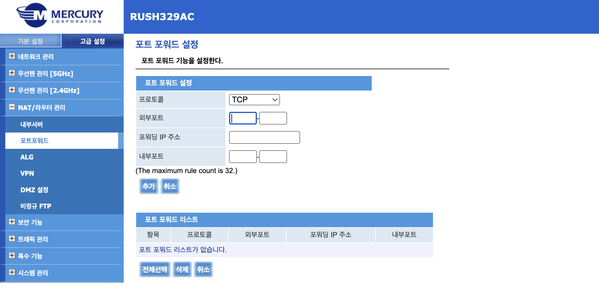

# 리눅스 설치
(우분투 배포판 이미지 받아서 설치. 적당한 블로그 찾아서 추천)
내가 사용한 우분투 버전은 Ubuntu 20.04.5 LTS

# 우분투 정상 작동 확인
```sh
$ sudo apt-get update
$ sudo apt-get upgrade
$ ping google.com
```

# ssh 연결
## 랜카드의 논리적 이름을 알아내는 명령어
```sh
sudo lshw -c network
```

## 결과
```
*-network
       description: Ethernet interface
       product: RTL~~~....
       vendor: RealTek Semiconductor Co., Ltd.
       physical id: 0
       bus info: pci@0000:00:~~
       logical name: enp4s0
       version: ~~
       serial: 00:00:00:00:00:00
       size: 1Gbit/s
       ~~~~
```
결과에서 logical name 기억해두기

# 랜카드 활성화
```sh
$ sudo vi /etc/netplan/01-network-manager-all.yaml
```

아래 내용 작성
```yaml
network:
    version: 2
    renderer: NetworkManager
    ethernets:
        enp4s0:
            dhcp4: yes
```

저장 후에 

```sh
sudo netplan apply
sudo reboot now
```

# 주소 알아내기
```sh
$ ip a
```

결과에서 앞서 확인한 논리명인 enp4s0 부분 확인하기  
```
2: wlp3s0: <BROADCAST,MULTICAST,UP,LOWER_UP> mtu 1500 qdisc fq_codel state UP group default qlen 1000
    link/ether **:**:**:**:**:** brd **:**:**:**:**:**
    inet 192.168.*.**/24 brd 192.168.*.255 scope global dynamic eno1
       valid_lft 3538sec preferred_lft 3538sec
    inet6 ****::****:****:****:****/64 scope link
       valid_lft forever preferred_lft forever
```
위 결과에서 inet 부분의 192.168.*.** 애 해당하는 주소로 같은 네트워크 하에서는 ssh 연결을 진행할 수 있음

서버에 ssh-server 설치해두기
```sh
$ sudo apt-get install openssh-server
```

# 같은 네트워크 하에 있지 않은 경우
포트포워딩 필요
sk 와이파이 쓰는 중이므로 이에 관해 설정
192.168.35.1 로 접속
만약 접속 안되면 
```sh
$ ipconfig /all
```
치고 기본 게이트웨이로 나온 주소로 접근
murcury corporation 페이지 나옴

로그인은  
id: admin 
pwd: 유선Mac뒷6자리_admin  
으로 가능

로그인 후 고급설정 > NAT 라우터 관리 > 포트포워드

- 프로토콜: Tcp 
- 외부포트: 서버로 진입할 때 사용할 포트로 임의 지정
- 포워딩 ip 주소: 포워딩할 서버의 내부 ip
- 내부포트: 내부에서 개방할 포트 범위
