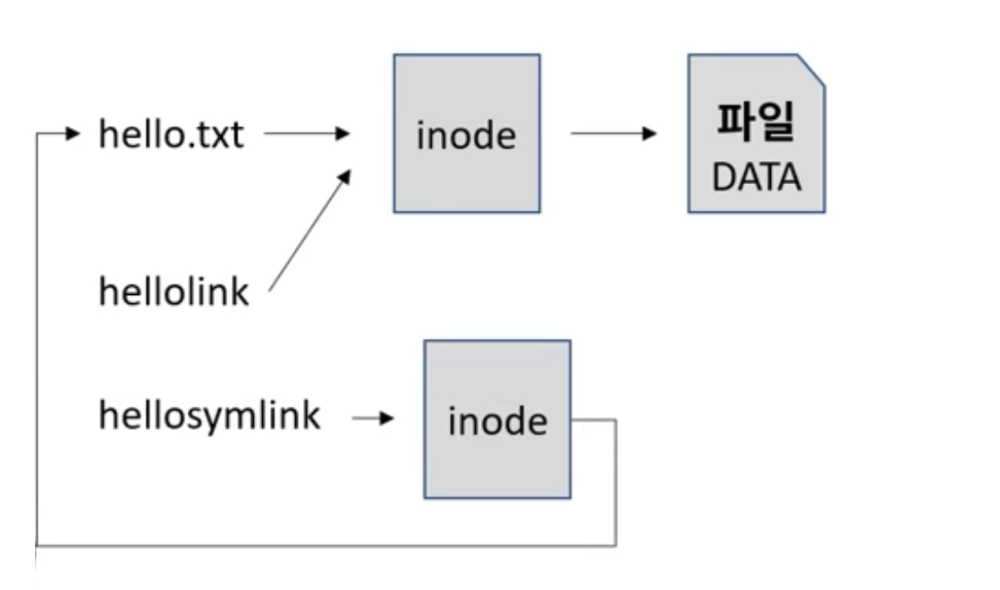

# 리눅스 파일 시스템 구조  

## inode
inode란 리눅스에서 파일을 관리하는 구조체입니다.  
파일은 실제 파일 데이터에 대한 포인터 역할을 하는데, 실제로는 inode를 중간에 거쳐서 파일을 가리키게 됩니다.  

### 하드링크  
어떠한 파일에 하드링크를 걸게 되면, 파일을 가르치는 포인터가 두개 생기는 것이므로 궁극적으로는 동일한 inode를 가리키는 포인터가 2개 생기게 됩니다.  

### 심볼릭 링크
심볼릭 링크는 다른 inode를 하나 만들고 해당 inode가 원본 파일의 포인터를 가리키는 구조로 생성됩니다.  

### inode 내부 정보  
inode에는 다양한 파일의 속성값과 권한, 파일 사이즈, 수정 시간 등의 정보들이 담겨있습니다.  
